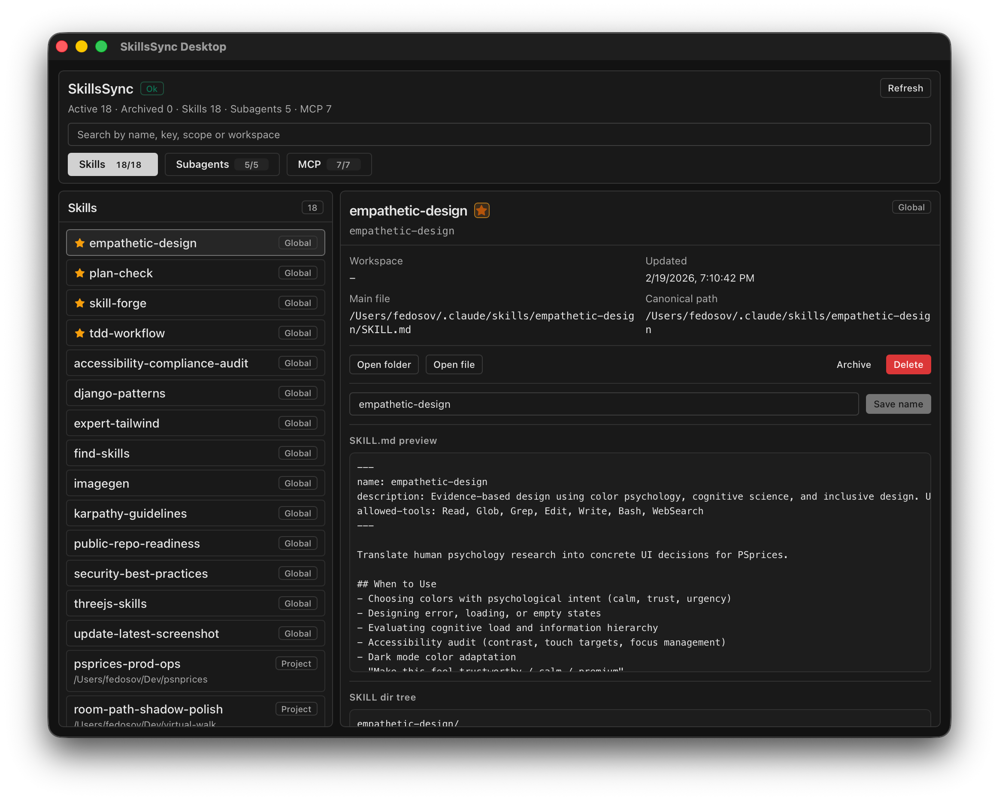

# SkillsSync

Keep one canonical skill catalog and sync it across agent runtimes (`Claude Code`, `Codex`, and others).

If a skill exists in one ecosystem but is missing in another, SkillsSync reconciles it by rebuilding managed links and updating managed registry entries.

## Screenshot



## What SkillsSync Solves

- Stops skill drift across `~/.claude/skills`, `~/.agents/skills`, and `~/.codex/skills`.
- Prevents "it exists in Claude Code but does not appear in Codex" situations.
- Gives a safe lifecycle for cleanup: archive, restore, promote project skills to global, rename, delete.
- Keeps sync behavior deterministic with explicit conflict handling.

## Why This Exists

Without synchronization, teams accumulate duplicate and stale skill folders across multiple agent directories. That creates inconsistent behavior between tools and broken expectations for users.

SkillsSync provides one sync engine that discovers skills, validates consistency, and applies a managed cross-agent layout.

## How Sync + Validation Works

Validation is part of the normal sync cycle (not a separate tool):

1. Discover skill packages in global and project roots.
2. Compare duplicates by `skill_key` and content hash.
3. Mark conflicts when same key has different content.
4. Optionally migrate canonical sources to Claude roots via `auto_migrate_to_canonical_source`.
5. Rebuild/update managed symlinks for target agent directories.
6. Update managed block in `~/.codex/config.toml` (`# skills-sync:begin` ... `# skills-sync:end`).

Result: once sync succeeds, cross-agent visibility is reconciled automatically.

## Cleanup Workflow (UI-first, safe)

Use the desktop app to review and confirm each mutation explicitly.

Supported actions:

- `Archive`: move active skill into runtime archives.
- `Restore`: bring archived skill back as active global skill.
- `Make global`: promote active project skill to global scope.
- `Rename`: normalize skill key from the new title and move path safely.
- `Delete`: remove active skill (moves payload to trash) or remove archived bundle.

All destructive/structural actions require confirmation.

## Quickstart (Desktop)

```bash
git clone https://github.com/fedosov/skills-sync.git
cd skills-sync
./scripts/run-tauri-gui.sh
```

## Headless Linux (CLI)

### One-shot sync

```bash
cd platform
cargo run -p skillssync-cli -- sync --trigger manual --json
```

### Optional environment diagnostics

```bash
cd platform
cargo run -p skillssync-cli -- doctor
```

### systemd service + timer (copy-paste example)

Build the binary first:

```bash
cd /opt/skills-sync/platform
cargo build -p skillssync-cli --release
sudo install -m 0755 target/release/skillssync /usr/local/bin/skillssync
```

Create `/etc/systemd/system/skillssync-sync.service`:

```ini
[Unit]
Description=SkillsSync manual sync run
After=network.target

[Service]
Type=oneshot
User=%i
ExecStart=/usr/local/bin/skillssync sync --trigger manual --json
```

Create `/etc/systemd/system/skillssync-sync.timer`:

```ini
[Unit]
Description=Run SkillsSync sync every 15 minutes

[Timer]
OnBootSec=2min
OnUnitActiveSec=15min
Unit=skillssync-sync.service

[Install]
WantedBy=timers.target
```

Enable timer:

```bash
sudo systemctl daemon-reload
sudo systemctl enable --now skillssync-sync.timer
systemctl list-timers | rg skillssync
```

If you need event-driven continuous mode instead of interval mode, use:

```bash
skillssync watch
```

## Prerequisites

- Rust and Cargo
- Node.js and npm
- Tauri system dependencies installed for your OS

## Run Tests

```bash
cd platform
cargo test
```

```bash
cd platform/apps/skillssync-desktop/ui
npm run test:coverage
```

## Repository Layout

- `platform/crates/skillssync-core`: shared sync engine
- `platform/crates/skillssync-cli`: command-line interface
- `platform/apps/skillssync-desktop`: desktop app (Tauri + React)

## Contributing

See `CONTRIBUTING.md`.
